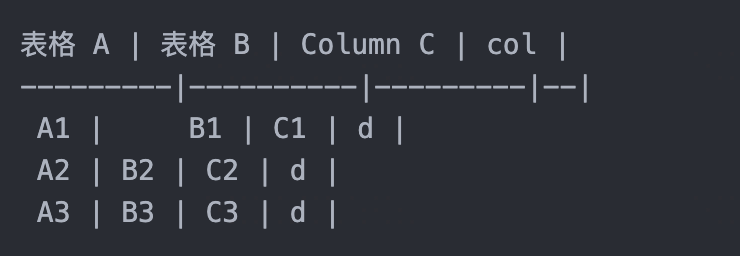

# H1

## H2

### H3

1. 有序列表
2. 有序列表

* 无序列表1
* 无序列表2

- 无序列表1
- 无序列表2 

表格 A | 表格 B | Column C | col |
---------|----------|---------|--|
 A1 |     B1 | C1 | d |
 A2 | B2 | C2 | d |
 A3 | B3 | C3 | d |


截屏粘贴图像：




**加粗**  

_斜体_

~~删除线~~

[超链接](http://test.html)

```
代码块
print("hello world!");
```

`行内代码`

> 引用  
> 引用  
> 引用  

- [ ] checkbox
- [ ] 测试
  
% 1